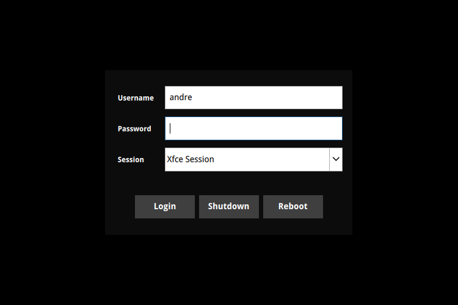

# sddm-minimal-dark

Super minimal dark theme for SDDM, based on [archlinux-simplyblack](https://github.com/Guidobelix/archlinux-themes-sddm/tree/master/archlinux-simplyblack).



## Install

```
sudo make install
```

Edit `/etc/sddm.conf.d/sddm.conf` and set:

```
[Theme]
Current=minimal-dark
```

## Uninstall

```
sudo make uninstall
```

Remember to update `sddm.conf`
